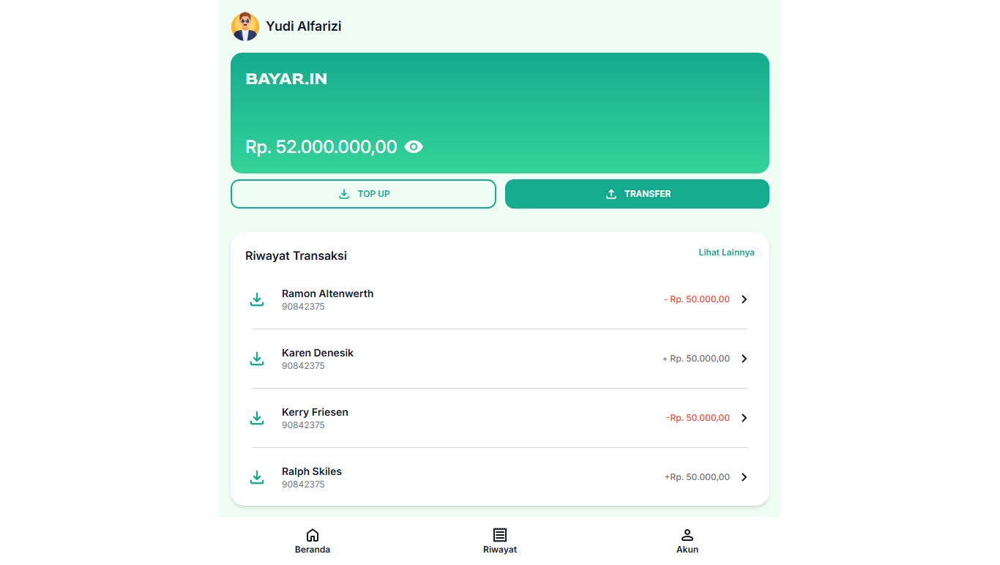

# Bayar.in

Bayar.in adalah prototype **UI dompet digital berbasis web** yang menampilkan fitur pembayaran, top-up, transfer, dan riwayat transaksi. Project ini dibangun menggunakan **HTML**, **CSS**, **JavaScript**, dan **Tailwind CSS**.



---

## 📌 Description
Bayar.in merupakan rancangan antarmuka pengguna (UI only) untuk dompet digital modern.  
Aplikasi ini dirancang agar mudah digunakan, responsif di berbagai perangkat, dan memiliki tampilan yang clean dan profesional.

Project ini tidak memiliki backend dan seluruh interaksi bersifat dummy/prototype.

---

## 🛠 Technologies Used
- **HTML5** – struktur halaman
- **CSS3** – styling dasar
- **JavaScript** – interaksi sederhana
- **Tailwind CSS** – styling modern dan responsif
<p align="left">
  
  
  
  
</p>

---

## ✨ Features
- **Dashboard Saldo** – menampilkan saldo utama
- **Form Top-Up** – form dummy untuk menambah saldo
- **Form Transfer** – form dummy untuk transfer saldo
- **Riwayat Transaksi** – daftar transaksi statis
- **Responsive Design** – tampilan optimal di desktop & mobile

---

## 🚀 Deployment
Project ini dapat diakses secara online melalui Netlify:

🔗 **[https://bayar-in.netlify.app](https://bayar-in.netlify.app)**

---

## 🧠 AI Support (IBM Granite)
Dalam proses pengembangan project ini, saya memanfaatkan **AI IBM Granite** untuk:
- Membuat animasi **sukses transfer** dan **sukses top up** agar tampilan lebih interaktif dan menarik.
- Membantu merancang dan membuat **halaman detail transaksi**.
- Memberikan saran penyesuaian styling agar animasi dan halaman baru tetap konsisten dengan tema Bayar.in.
- Membantu menyusun dokumentasi project (README.md) dan poin-poin untuk slide presentasi.

---

## 📦 Setup Instructions

### **1. Menjalankan Secara Langsung (Tanpa Build)**
1. Download atau clone repository ini.
2. Masuk ke folder `dist/`.
3. Klik dua kali `index.html` untuk membukanya di browser.

### **2. Menjalankan dengan Node.js (Build Ulang Tailwind)**
> Opsi ini digunakan jika ingin mengedit source code di folder `src/`.

1. Pastikan sudah menginstal **Node.js** dan **npm**.
2. Clone repository:
   ```bash
   git clone https://github.com/username/bayar-in.git
3. Masuk ke folder project: cd bayar-in
4. Install dependency: npm install
5. Build Tailwind CSS: npm run build
6. Hasil build ada di folder dist/.
7. Buka dist/index.html di browser.
